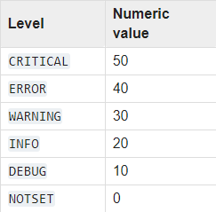

# Aiogram AWS serverless example

[![AWS API Gateway](https://img.shields.io/badge/AWS-API%20Gateway-orange?style=flat-square&logo=data:image/png;base64,iVBORw0KGgoAAAANSUhEUgAAAEAAAABACAYAAACqaXHeAAAHlElEQVR4Xu2Ye3BU1R3Hv+fs3n0SkohgMQR8UKUtZEzDEgQcU2gUGgsSOrSDEx88lFeLRZGQpE5olkRLFERFpVCcShEEgVYoLYi1FESSQLC22FHG0iJKedtk9+7j3nM656Skiph7d/eWzUzumck/2d/z83ucs0vQxQ/p4vnDBmB3QBcnYI9AF28AewnaI2CPQBcnYI9AF28A+xawR8AegS5O4P82AvzJm71qRBvDgFsJx40cyOaARkE+BmHNINjuK286RAh4OmtgOYAz1YXdPU4+H5zPAkWmQXIHAfKov7JhW7ogWApArR1yi8b1lyloTiIJcYZ1qst1f8/5e1sS0bNC1jIA4dpAqa5jHaVQkgzsoBZ3FmdW7zubpH5SapYAUIMFIzRO30gh+f8GT/b44q2jSPXhWFLZJKGUMoBTjw/P8Gixv1IgNwn/l1AhC/2VDdXiA85BUJ/nQ78bI2TiBt0a+5+3kjKAUDCwEASPWhUcY4gSJ+6EhnsIMEYsUvE/B+F7OKFLrF6YKQHgy/q7wy2ZHwP0CqsAGNvhT/sqmuZYdX2mBCC0aEgJwLcaB22tBOHkIV9Vw5NWWE0JQDgYqOME5VYEkogNwlhLyOXJseLaTAlAaFFgI4AJiQRvmSwh4/0VDVtStZcagGBgBwiKUw0iGX3O2CugZKXfq+whc/epydgQOkkBCNUFAtCxiHF8m9LkbCQb8MV6YhwAuiKqx4PZ1YfOJ2o3YQDh4ODZOudLKaWOSzkjWVfDcd1QQNegvfMbKUJ7fRW0zyDo7/8JvPWU5O7MHw8ebYF+eGebzJXXgPb9JvQje8H//S8Qfw8480pAsnLAIy3Q33sd7MTfvjQ/BnbcwUmpr6qpIREICQEI1QamgWNFRw6UoplQht0rRdTnJ4CfPQbHgJFwlz6G2GsLob27DSSzN7yzfg3EIwjXFwGcQbl1OpThk6WOgOe570X5EmLHDoHm3gTizURkzXSwj975UvecIUQdpNhX0bDPLATTAFpqC78Ozpop4OrIuGfKGvDwOTiuLUTsd49DO/iqrKJ35mbE334J8TeehqP/cLgnLmmD9NwE8HPH4J7wM9BrBkN9YhSUkbOhDC1DZOUksJNHQHv1h2fqWmgHNiD2+8Ud50ZwksWUQRnVb500A8E0gNCiwVsBUtKRUdLtSnh/9FvEtgWhjJgiWzb66nyp4p27C+z4u4iufxDKzXfDedOdINl9EN04D/r7f4R3+kawllOI/moGXONq4PzG7VCfGg0eOgtQB5x5d4CdPQb2z4PGeXG+yl/VNNVY0OQSVGuGXMso/9DIoDPvu3Dd8RNZVeWWqXD0HwF1SbFscfddz4Fm50B9ZixcY+VTH46+BdCaRWesge+R3Yg3rEV81zIJSPnWbOgf7JYVFzshkcMY04mb9un2SOMJIz1THRCqDcwAx3IjY+7xdaC5eVCXlcCZXwrXmHJEVt8L9slhKKPmQCm8C2p9EdxlL8jlJ5YeYmHE9/5Ctnh0SxX0wzsApxvu0joJUMDTjzZCa1wP/cgeoxDaP+cEk7tVNK42UjAFIFwTqOcUD3VojFB4f7wT7MN9MhHa8zp4pq1D/M3liL/1IpwDR8M19qeI/HIaPJOeRXRTOWjffJmkAOAeV9O+Dy74oVcPlHqOgWNAPBmI7XxCgjBzCMdjvqrGBUaypgC01gaWEI4HOzImNrWnbAV462n5Jw79ygDoR5sQXTtTXnOe+1+Ri1AsOPXZcXDk5suREa0vrkWxAAEOktFLzj3/9BNph2T0hPeBDdKu+vz3jHJq0+Go91U1zjMSNgugnHDUdWRMKZoBZdh90Jo3gcfaHmaiujSrN8IiMT0O38N/AA+fB/FlIby4CPSqG+CZ8hL4+eNgn56QC1Aczz2rQLJzoS69rd2luBYFCDFeZo7ZL0ymAITqCgvAWFNHjkUionLq0tGyiuIIIAJM9OUfQv/7fnjuXgnaJ0/uBLEb4HTBN283QGj7FSn0XMVz4Qz8ANHNC6C/twu099fgKfs5dDFeGw2LKn0z8EEZlU1/MYJlCoAwEq4N7OIcIy9lkPivgHfOdhlsdHNFuwjNGSSreeH+d932MJyDJ0L782uIba1pq/YDG0B79EN0S2X7q5D4s+GetBy05/XysQTFIx9UkfVzwM99ZJST+Hy7v7LxO2YETQOI1BRcr1MquiDrC4YdLpBuPYBoq3y2th9CQbpfJZMQjyPi9gOe7p+TE/DE1uetZwD9Mz8FEvHb8kCIz3nLadk14kYwPIydoYQVeKua/2Eom+iXoXCwcCgn2rbL+wuQmTTaZU6D0tH+BfsPmNUy3QEXDKrB/H6MOF8AcLtZJ5dFjmMrUegM3/z9pmbkQkwJA/gfiIIRDHQy4xhFKfpeliQvcsI5O0oIfZ1wuspXtf/tZGJIGsBnnfHFef71ByI7OCfDkgkiUR1C2JvfH9C9hFQfCCeqe7G8JQCE0VXjb5jFiVaWakDm9B2rp276QIxhyscyAClHkiYDNoA0ge80bu0O6DSlSFMgdgekCXyncWt3QKcpRZoCsTsgTeA7jVu7AzpNKdIUiN0BaQLfadzaHdBpSpGmQP4DeT6+X1wZ9UAAAAAASUVORK5CYII=)](https://aws.amazon.com/api-gateway/)
[![AWS Lambda](https://img.shields.io/badge/AWS-Lambda-orange?style=flat-square&logo=data:image/png;base64,iVBORw0KGgoAAAANSUhEUgAAAEAAAABACAYAAACqaXHeAAAHlElEQVR4Xu2Ye3BU1R3Hv+fs3n0SkohgMQR8UKUtZEzDEgQcU2gUGgsSOrSDEx88lFeLRZGQpE5olkRLFERFpVCcShEEgVYoLYi1FESSQLC22FHG0iJKedtk9+7j3nM656Skiph7d/eWzUzumck/2d/z83ucs0vQxQ/p4vnDBmB3QBcnYI9AF28AewnaI2CPQBcnYI9AF28A+xawR8AegS5O4P82AvzJm71qRBvDgFsJx40cyOaARkE+BmHNINjuK286RAh4OmtgOYAz1YXdPU4+H5zPAkWmQXIHAfKov7JhW7ogWApArR1yi8b1lyloTiIJcYZ1qst1f8/5e1sS0bNC1jIA4dpAqa5jHaVQkgzsoBZ3FmdW7zubpH5SapYAUIMFIzRO30gh+f8GT/b44q2jSPXhWFLZJKGUMoBTjw/P8Gixv1IgNwn/l1AhC/2VDdXiA85BUJ/nQ78bI2TiBt0a+5+3kjKAUDCwEASPWhUcY4gSJ+6EhnsIMEYsUvE/B+F7OKFLrF6YKQHgy/q7wy2ZHwP0CqsAGNvhT/sqmuZYdX2mBCC0aEgJwLcaB22tBOHkIV9Vw5NWWE0JQDgYqOME5VYEkogNwlhLyOXJseLaTAlAaFFgI4AJiQRvmSwh4/0VDVtStZcagGBgBwiKUw0iGX3O2CugZKXfq+whc/epydgQOkkBCNUFAtCxiHF8m9LkbCQb8MV6YhwAuiKqx4PZ1YfOJ2o3YQDh4ODZOudLKaWOSzkjWVfDcd1QQNegvfMbKUJ7fRW0zyDo7/8JvPWU5O7MHw8ebYF+eGebzJXXgPb9JvQje8H//S8Qfw8480pAsnLAIy3Q33sd7MTfvjQ/BnbcwUmpr6qpIREICQEI1QamgWNFRw6UoplQht0rRdTnJ4CfPQbHgJFwlz6G2GsLob27DSSzN7yzfg3EIwjXFwGcQbl1OpThk6WOgOe570X5EmLHDoHm3gTizURkzXSwj975UvecIUQdpNhX0bDPLATTAFpqC78Ozpop4OrIuGfKGvDwOTiuLUTsd49DO/iqrKJ35mbE334J8TeehqP/cLgnLmmD9NwE8HPH4J7wM9BrBkN9YhSUkbOhDC1DZOUksJNHQHv1h2fqWmgHNiD2+8Ud50ZwksWUQRnVb500A8E0gNCiwVsBUtKRUdLtSnh/9FvEtgWhjJgiWzb66nyp4p27C+z4u4iufxDKzXfDedOdINl9EN04D/r7f4R3+kawllOI/moGXONq4PzG7VCfGg0eOgtQB5x5d4CdPQb2z4PGeXG+yl/VNNVY0OQSVGuGXMso/9DIoDPvu3Dd8RNZVeWWqXD0HwF1SbFscfddz4Fm50B9ZixcY+VTH46+BdCaRWesge+R3Yg3rEV81zIJSPnWbOgf7JYVFzshkcMY04mb9un2SOMJIz1THRCqDcwAx3IjY+7xdaC5eVCXlcCZXwrXmHJEVt8L9slhKKPmQCm8C2p9EdxlL8jlJ5YeYmHE9/5Ctnh0SxX0wzsApxvu0joJUMDTjzZCa1wP/cgeoxDaP+cEk7tVNK42UjAFIFwTqOcUD3VojFB4f7wT7MN9MhHa8zp4pq1D/M3liL/1IpwDR8M19qeI/HIaPJOeRXRTOWjffJmkAOAeV9O+Dy74oVcPlHqOgWNAPBmI7XxCgjBzCMdjvqrGBUaypgC01gaWEI4HOzImNrWnbAV462n5Jw79ygDoR5sQXTtTXnOe+1+Ri1AsOPXZcXDk5suREa0vrkWxAAEOktFLzj3/9BNph2T0hPeBDdKu+vz3jHJq0+Go91U1zjMSNgugnHDUdWRMKZoBZdh90Jo3gcfaHmaiujSrN8IiMT0O38N/AA+fB/FlIby4CPSqG+CZ8hL4+eNgn56QC1Aczz2rQLJzoS69rd2luBYFCDFeZo7ZL0ymAITqCgvAWFNHjkUionLq0tGyiuIIIAJM9OUfQv/7fnjuXgnaJ0/uBLEb4HTBN283QGj7FSn0XMVz4Qz8ANHNC6C/twu099fgKfs5dDFeGw2LKn0z8EEZlU1/MYJlCoAwEq4N7OIcIy9lkPivgHfOdhlsdHNFuwjNGSSreeH+d932MJyDJ0L782uIba1pq/YDG0B79EN0S2X7q5D4s+GetBy05/XysQTFIx9UkfVzwM99ZJST+Hy7v7LxO2YETQOI1BRcr1MquiDrC4YdLpBuPYBoq3y2th9CQbpfJZMQjyPi9gOe7p+TE/DE1uetZwD9Mz8FEvHb8kCIz3nLadk14kYwPIydoYQVeKua/2Eom+iXoXCwcCgn2rbL+wuQmTTaZU6D0tH+BfsPmNUy3QEXDKrB/H6MOF8AcLtZJ5dFjmMrUegM3/z9pmbkQkwJA/gfiIIRDHQy4xhFKfpeliQvcsI5O0oIfZ1wuspXtf/tZGJIGsBnnfHFef71ByI7OCfDkgkiUR1C2JvfH9C9hFQfCCeqe7G8JQCE0VXjb5jFiVaWakDm9B2rp276QIxhyscyAClHkiYDNoA0ge80bu0O6DSlSFMgdgekCXyncWt3QKcpRZoCsTsgTeA7jVu7AzpNKdIUiN0BaQLfadzaHdBpSpGmQP4DeT6+X1wZ9UAAAAAASUVORK5CYII=)](https://aws.amazon.com/lambda/)

Simple echo Telegram bot example on aiogram framework using AWS API Gateway & Lambda.
## Deploy
### Create deployment package
- Clone this repository: `git clone https://github.com/DavisDmitry/aiogram-aws-serverless-example.git`
- Change to the directory with the repository copy: `cd aiogram-aws-serverless-example`
- Run create-package bash script: `./create-package.sh`
### Create, configure and deploy a Lambda function
- [Create a new bot at botfather](https://core.telegram.org/bots#6-botfather)
- Create AWS Lambda function, set environment variables and deploy package:

    <a href="https://youtu.be/JHOD82e9WwE">
         
        (video)
    </a>

#### Environment variables:
- `TOKEN`: Bot API token from botfather
- `LOGGING_LEVEL`: logging level (optional), default - `info`

    

### Create and configure API Gateway entrypoint
- Create and configure API Gateway entrypoint:

    <a href="https://youtu.be/hCjq54H37Gs">
         
        (video)
    </a>

- Set webhook for your bot: follow the link through your browser or using curl – `https://api.telegram.org/bot{your_bot_api_token}/setWebhook?url={your_api_gateway_url}`
### Profit!

    

